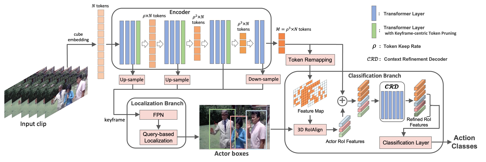

# Official PyTorch Implementation of EVAD



> [**Efficient Video Action Detection with Token Dropout and Context Refinement**](https://arxiv.org/abs/2304.08451)<br>[Lei Chen](https://github.com/MiaSanLei), [Zhan Tong](https://github.com/yztongzhan), [Yibing Song](https://ybsong00.github.io/), Gangshan Wu, [Limin Wang](http://wanglimin.github.io/)<br>

## News
**[2023.07.14]**  Our EVAD is accepted by ICCV 2023! <br>
**[2023.06.09]**  Code and model weights have been released! <br>

## Installation

Please find installation instructions in [INSTALL.md](INSTALL.md). 

## Data Preparation

Please follow the instructions in [DATASET.md](slowfast/datasets/DATASET.md) to prepare AVA dataset.

## Model Zoo

| method | keep rate | enhanced weight |                            config                            |      backbone      |                          pre-train                           | #frame x sample rate | GFLOPs | mAP  |                            model                             |
| ------ | :-------: | :-------------: | :----------------------------------------------------------: | :----------------: | :----------------------------------------------------------: | :------------------: | :----: | :--: | :----------------------------------------------------------: |
| EVAD   |    1.0    |        1        |     [ViT_B_16x4](projects/evad/configs/ViT_B_16x4.yaml)      |  ViT-B (VideoMAE)  | [K400](https://drive.google.com/file/d/1391ekf5OluiHzV9-rnk5Ip-Cw2ySsTQv/view?usp=sharing) |         16x4         |  425   | 32.1 | [link](https://drive.google.com/file/d/1gBqYhNmE0RBidSfG-QSaU1ur_hwv1i2u/view?usp=sharing) |
| EVAD   |    0.7    |        1        | [ViT_B_16x4_KTP](projects/evad/configs/ViT_B_16x4_KTP.yaml)  |  ViT-B (VideoMAE)  | [K400](https://drive.google.com/file/d/1391ekf5OluiHzV9-rnk5Ip-Cw2ySsTQv/view?usp=sharing) |         16x4         |  243   | 32.3 | [link](https://drive.google.com/file/d/1cvFLZNuP6jfGSkE7UCdI1cJTennqXsMS/view?usp=sharing) |
| EVAD   |    0.6    |        4        | [ViT_B_16x4_KTP_EW](projects/evad/configs/ViT_B_16x4_KTP_EW.yaml) |  ViT-B (VideoMAE)  | [K400](https://drive.google.com/file/d/1391ekf5OluiHzV9-rnk5Ip-Cw2ySsTQv/view?usp=sharing) |         16x4         |  209   | 31.8 | [link](https://drive.google.com/file/d/1toUWQTQz1SlkZ0k2_AC5l58-GfNpbZTw/view?usp=sharing) |
| EVAD   |    0.7    |        1        | [ViT_B_16x4_KTP](projects/evad/configs/ViT_B_16x4_KTP.yaml)  | ViT-B (VideoMAEv2) | [K710+K400](https://drive.google.com/file/d/1-4z8mj5R3NonMhS6YcndUjncv4gvP86-/view?usp=sharing) |         16x4         |  243   | 37.7 | [link](https://drive.google.com/file/d/1Sy2vIRNEGFA507s4Ar_TRiqyJHT7e0mg/view?usp=sharing) |
| EVAD   |    0.7    |        1        | [ViT_L_16x4_KTP](projects/evad/configs/ViT_L_16x4_KTP.yaml)  |  ViT-L (VideoMAE)  | [K700](https://drive.google.com/file/d/1SZ_TfsigcCvEMxdaAmtHBLNEkjEuLalU/view?usp=sharing) |         16x4         |  737   | 39.7 | [link](https://drive.google.com/file/d/1FVosE4p27a4GDwG_PNYtGbkupx4vGOi-/view?usp=sharing) |

## Training

```
python -m torch.distributed.launch --nproc_per_node=8 projects/evad/run_net.py --cfg "projects/evad/configs/config_file.yaml" DATA.PATH_TO_DATA_DIR "path/to/ava" TRAIN.CHECKPOINT_FILE_PATH "path/to/pretrain.pth" OUTPUT_DIR "path/to/output"
```

## Validation

You can load specific checkpoint file with `TEST.CHECKPOINT_FILE_PATH` or autoload the last checkpoint from the output folder.

```
python -m torch.distributed.launch --nproc_per_node=1 projects/evad/run_net.py --cfg "projects/evad/configs/config_file.yaml" DATA.PATH_TO_DATA_DIR "path/to/ava" TRAIN.ENABLE False TEST.ENABLE True NUM_GPUS 1 OUTPUT_DIR "path/to/output"
```

## Acknowledgements

This project is built upon [SparseR-CNN](https://github.com/PeizeSun/SparseR-CNN) and [PySlowFast](https://github.com/facebookresearch/SlowFast). We also reference and use some code from [WOO](https://gist.github.com/ShoufaChen/263eaf55599c6e884584d7fce445af45) and [VideoMAE](https://github.com/MCG-NJU/VideoMAE).  Thanks to the contributors of these great codebases.

## License

The majority of this project is released under the CC-BY-NC 4.0 license as found in the [LICENSE](LICENSE) file. Portions of the project are available under separate license terms: [SlowFast](https://github.com/facebookresearch/SlowFast) and [pytorch-image-models](https://github.com/rwightman/pytorch-image-models) are licensed under the Apache 2.0 license. [SparseR-CNN](https://github.com/PeizeSun/SparseR-CNN) is licensed under the MIT license.

## Citation

If you find this project useful, please feel free to leave a star and cite our paper:
```BibTeX
@article{chen2023efficient,
  title={Efficient Video Action Detection with Token Dropout and Context Refinement},
  author={Chen, Lei and Tong, Zhan and Song, Yibing and Wu, Gangshan and Wang, Limin},
  journal={arXiv preprint arXiv:2304.08451},
  year={2023}
}
```
